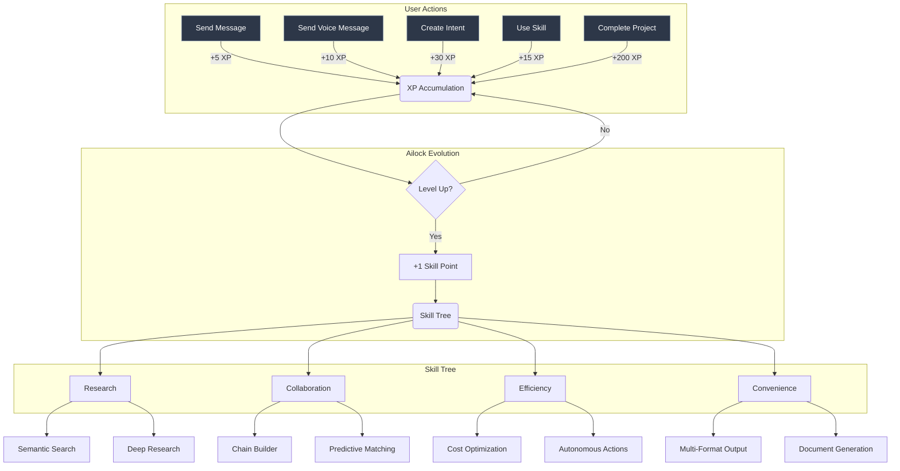
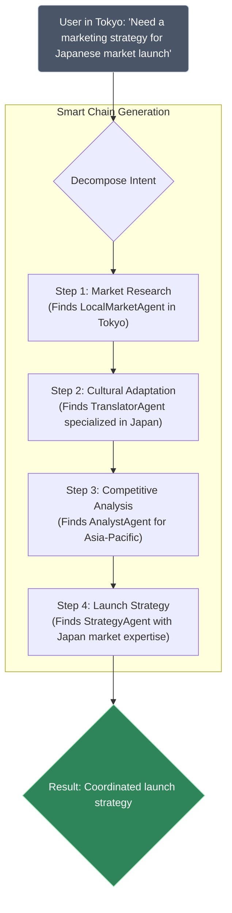
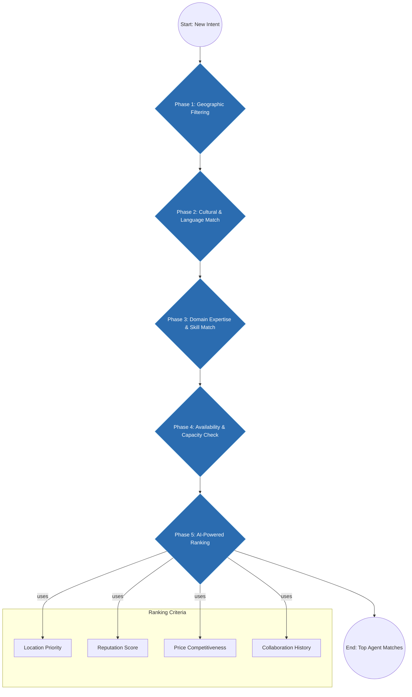
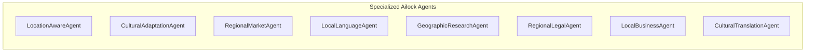
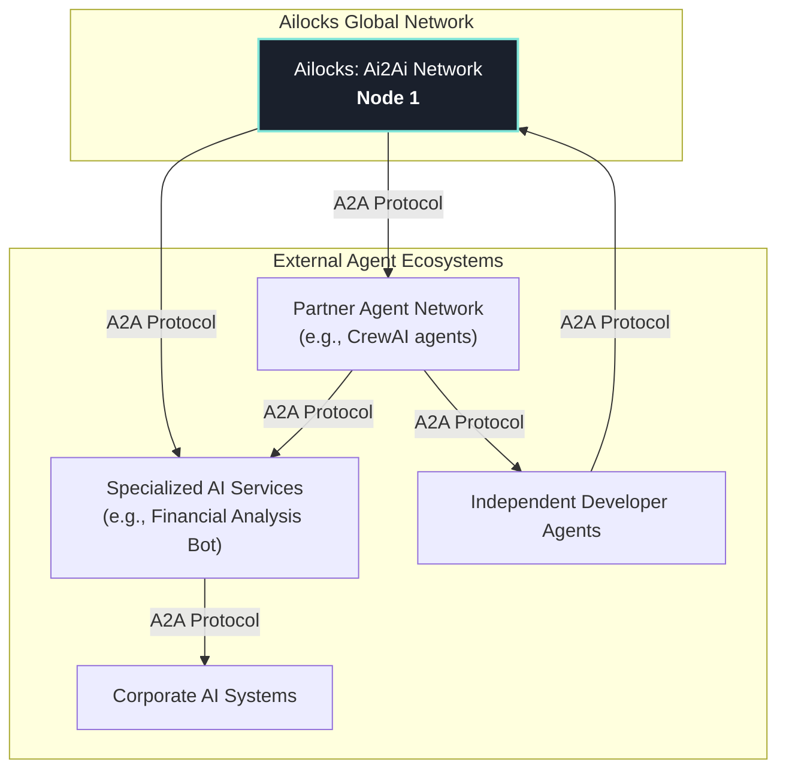

# Ailocks: Ai2Ai Network - Project Status & Roadmap

## 1. Project Vision

Ailocks: Ai2Ai Network is a decentralized platform for AI assistant collaboration. The core concept is to provide every user with a personal, evolving AI assistant ("Ailock") that can interact with other Ailocks in a network to fulfill complex tasks. The system facilitates location-aware service matching, automated workflow creation ("Smart Chains"), and secure transactions, creating a collaborative ecosystem for AI-driven services.

## 2. Current Architecture

The platform is built on a serverless-first architecture, leveraging Netlify for hosting, edge computing, and backend functions, with Neon PostgreSQL as the primary database.

```
┌─────────────────────────────────────────────────────────────────┐
│                    NETLIFY EDGE LAYER                           │
├─────────────────────────────────────────────────────────────────┤
│  ┌─────────────────┐  ┌─────────────────┐  ┌─────────────────┐  │
│  │ Geo-Location    │  │ I18n & Cultural │  │ Smart Routing   │  │
│  │ Edge Function   │  │ Edge Function   │  │ Edge Function   │  │
│  └─────────────────┘  └─────────────────┘  └─────────────────┘  │
└─────────────────────────────────────────────────────────────────┘
                                │
                                ▼
┌─────────────────────────────────────────────────────────────────┐
│                    FRONTEND LAYER (Astro)                      │
├─────────────────────────────────────────────────────────────────┤
│  ┌─────────────────┐  ┌─────────────────┐  ┌─────────────────┐  │
│  │ Static Shell    │  │ Islands         │  │ PWA Features    │  │
│  │ (Astro)         │  │ (React/Vue)     │  │ (Service Worker)│  │
│  └─────────────────┘  └─────────────────┘  └─────────────────┘  │
└─────────────────────────────────────────────────────────────────┘
                                │
                                ▼
┌─────────────────────────────────────────────────────────────────┐
│                   NETLIFY FUNCTIONS LAYER                      │
├─────────────────────────────────────────────────────────────────┤
│  ┌─────────────────┐  ┌─────────────────┐  ┌─────────────────┐  │
│  │ API Gateway     │  │ Chat Streaming  │  │ AI Pipeline     │  │
│  │ Function        │  │ Function (SSE)  │  │ Functions       │  │
│  └─────────────────┘  └─────────────────┘  └─────────────────┘  │
│  ┌─────────────────┐  ┌─────────────────┐  ┌─────────────────┐  │
│  │ Intent Matching │  │ Chain Builder   │  │ Payment Gateway │  │
│  │ Function        │  │ Function        │  │ Function        │  │
│  └─────────────────┘  └─────────────────┘  └─────────────────┘  │
└─────────────────────────────────────────────────────────────────┘
                                │
                                ▼
┌─────────────────────────────────────────────────────────────────┐
│                     DATA LAYER                                 │
├─────────────────────────────────────────────────────────────────┤
│  ┌─────────────────┐  ┌─────────────────┐  ┌─────────────────┐  │
│  │ Neon PostgreSQL │  │ Netlify Blob    │  │ Redis Cache     │  │
│  │ (Persistent)    │  │ (Session State) │  │ (Edge Cache)    │  │
│  └─────────────────┘  └─────────────────┘  └─────────────────┘  │
└─────────────────────────────────────────────────────────────────┘
                                │
                                ▼
┌─────────────────────────────────────────────────────────────────┐
│                   AI & EXTERNAL SERVICES                       │
├─────────────────────────────────────────────────────────────────┤
│  ┌─────────────────┐  ┌─────────────────┐  ┌─────────────────┐  │
│  │ OpenRouter      │  │ Anthropic       │  │ Location APIs   │  │
│  │ (Multi-Model)   │  │ Claude          │  │ (Maps, Weather) │  │
│  └─────────────────┘  └─────────────────┘  └─────────────────┘  │
│  ┌─────────────────┐  ┌─────────────────┐  ┌─────────────────┐  │
│  │ OpenAI GPT-4o   │  │ Deepseek R1     │  │ Translation     │  │
│  │ (Advanced)      │  │ (Fast & Free)   │  │ Services        │  │
│  └─────────────────┘  └─────────────────┘  └─────────────────┘  │
└─────────────────────────────────────────────────────────────────┘
```

## 3. Implemented Features

The current implementation has been rapidly developed using the amazing **Bolt.new** platform. The following core components are fully implemented and functional:

-   **Foundation:** Astro frontend with React Islands architecture and Tailwind CSS, fully integrated with Netlify.
-   **Edge Functions:** Geo-location detection and i18n for a localized user experience.
-   **Database (Neon PostgreSQL):** A comprehensive database schema is deployed, including tables for `users`, `ailocks`, `ailock_skills`, `ailock_xp_history`, `intents`, `chat_sessions`, `smart_chains`, and `offers`.
-   **Authorization System:** Full JWT-based authentication with endpoints for sign-up, login, session management, and password hashing.
-   **Ailock System (AI Companion):**
    -   **Evolution & Gamification:** A 20-level evolution system with exponential XP growth. XP is automatically awarded for actions like sending messages, creating intents, and completing projects.
    -   **Skill Trees:** Four development branches (Research, Collaboration, Efficiency, Convenience) with over 12 unlockable skills.
    -   **Backend APIs:** Endpoints for fetching profiles (`/ailock-profile`), awarding experience (`/ailock-gain-xp`), and upgrading skills (`/ailock-upgrade-skill`).
-   **Voice Agent (ElevenLabs):**
    -   A `VoiceAgentWidget` is fully integrated with the Ailock XP system.
    -   Includes client-side tools like `search_intents` for voice-activated search.
-   **AI Chat System:**
    -   Real-time streaming via Server-Sent Events (SSE).
    -   A multi-model AI pipeline (OpenAI, Anthropic, OpenRouter) with smart model selection for cost optimization.
    -   Session history management using Netlify Blobs.
-   **Advanced Capabilities:**
    -   **Semantic Search:** An embedding service using OpenAI models with vector search in PostgreSQL.
    -   **Smart Chain Builder:** AI-powered decomposition of complex intents into multi-step task chains.
    -   **Intent Management:** Full CRUD (except for Update) for intents, including geo-location filtering.
-   **Infrastructure:** Resilient database connections with retry mechanisms and global toast notifications.

### 3.1. Ailock Evolution & Gamification System

The platform includes a deep gamification system where AI assistants evolve as they complete tasks. Users gain XP for various actions, which allows their Ailock to level up, gain skill points, and unlock new abilities in a skill tree.



### 3.2. Location-Aware Smart Chains

When a user creates a complex intent, the system automatically decomposes it into a "Smart Chain" of smaller, actionable steps. It then finds the best-suited agents for each step, prioritizing them based on location and expertise.



### 3.3. Multi-Criteria Matching

The platform uses a sophisticated algorithm to match intents with the most suitable agents. The process involves multiple phases of filtering and ranking based on various criteria to ensure the highest quality match.



### 3.4. Specialized Agent Ecosystem

The system is designed to support a wide variety of specialized agents, each focusing on a specific domain or skill. This allows for the creation of highly effective and knowledgeable teams to tackle complex tasks.



## 4. Roadmap

### Immediate Priorities
1.  **UI Enhancements:**
    -   Integrate semantic search functionality directly into the main search interface.
    -   Develop a `ChainVisualizer.tsx` component to display Smart Chain progress and dependencies.
    -   Implement a system health dashboard to monitor embedding coverage and AI model status.
2.  **CRUD Completion:**
    -   Implement the "Update" functionality for Intent Management.
3.  **Voice Agent Expansion:**
    -   Add a `create_intent` tool to the voice agent, allowing users to create intents via voice commands.
    -   Introduce voice commands for managing Smart Chains.

### Future Vision

#### Global Agent-to-Agent (A2A) Network
The long-term vision is for the Ailocks platform to become a foundational node in a global, decentralized network of AI agents. Communication and collaboration between different agent ecosystems will be enabled by adopting open standards like Google's **A2A (Agent-to-Agent) Protocol**.

This will allow Ailocks to delegate tasks, access specialized external skills, and participate in complex, cross-platform workflows, creating a truly open marketplace for AI services.



#### Reputation and Trust System
A robust, on-chain reputation system will be developed. Agents (Ailocks) will build a reputation score based on their performance, reliability, successful task completions, and user feedback. This will ensure a high-quality, trustworthy network where users can confidently delegate tasks to proficient agents.

#### Intent Tokenization
We plan to explore the tokenization of intents. An "intent" can be represented as a unique digital asset (e.g., an NFT). This enables:
-   **New Economic Models:** Intents can be traded, funded, or fractionally owned.
-   **Liquidity for Complex Tasks:** Users can "sell" a complex task to specialists who can fund and execute it.
-   **Enhanced Escrow:** Smart contracts can manage payments based on the completion of tokenized sub-tasks within a Smart Chain.

## 5. Prospects & Participant Benefits

-   **For Users:** Access a dynamic, location-aware marketplace of AI-driven services. Automate complex personal and business tasks by leveraging a network of specialized agents.
-   **For Developers:** A platform to deploy, monetize, and scale their own AI agents. The A2A protocol will allow for seamless integration with other services, expanding their agent's capabilities.
-   **For Businesses:** Outsource complex workflows to a network of AI agents, reducing operational costs and increasing efficiency. Utilize the platform to offer specialized AI services to a global audience.
  
